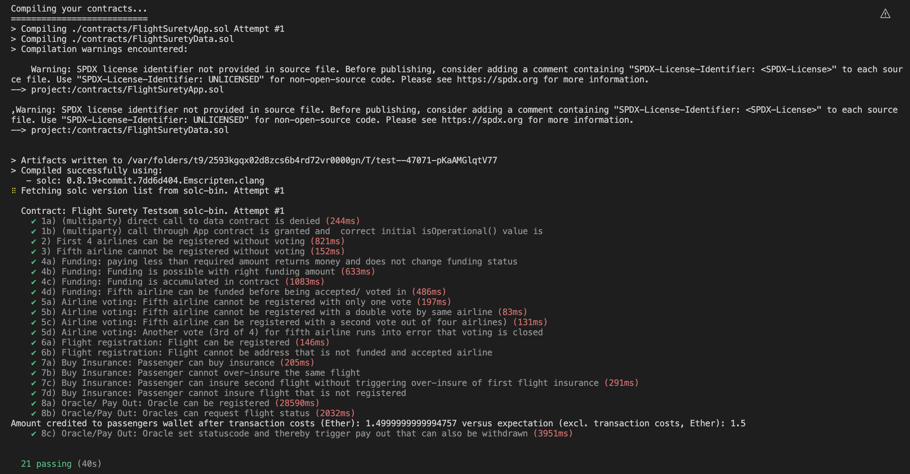

# FlightSurety

FlightSurety is a sample application project for Udacity's Blockchain course.

## Install

This repository contains Smart Contract code in Solidity (using Truffle), tests (also using Truffle), dApp scaffolding (using HTML, CSS and JS) and server app scaffolding.

To install, download or clone the repo, then:

`npm install`
`truffle compile`

## Develop Client

To run truffle tests:

`truffle test ./test/flightSurety.js`

`truffle test ./test/oracles.js`

To use the dapp:

`truffle migrate`
`npm run dapp`

To view dapp:

`http://localhost:8000`

## Develop Server

`npm run server`
`truffle test ./test/oracles.js`

## Environment used
Truffle v5.7.7 (core: 5.7.7)
Ganache v7.7.5
Solidity - ^0.8.17 (solc-js)
Node v14.21.2
Web3.js v1.8.2

# Usage of Dapp

## 0. Update (Ganache) accounts in 2_deploy_contract.js

## 1. Set up contracts

### 1.1 Connect App contract to data contract with owner user
### 1.2 Register oracles
Depending on number of oracles in oracleAddress (see 2_deploy_contracts.js) update Amount to at least 1 Ether registration fee per Oracle

## 2. Register and fund airlines
Use owner account for registration. Both buttons are in relation to airline selected in drop-down.

## 3. Register flight

## 4. Buy Insurance

## 5. Trigger fetching flight information from oracles and trigger insurance claim processing
Go back to airline section and press button "Check flight status & insurance" with owner account

## 6. Withdraw insurance pay out
First "Update Withdrawable amount" with passenger account. Then "Withdraw Insurance Payout"

